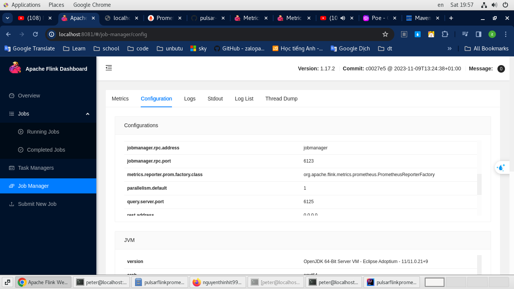
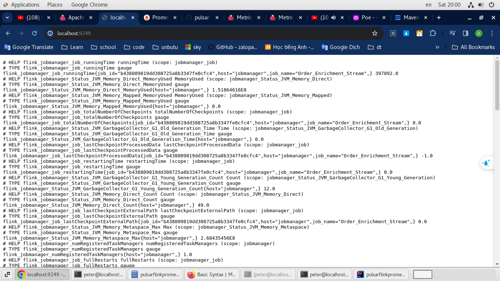
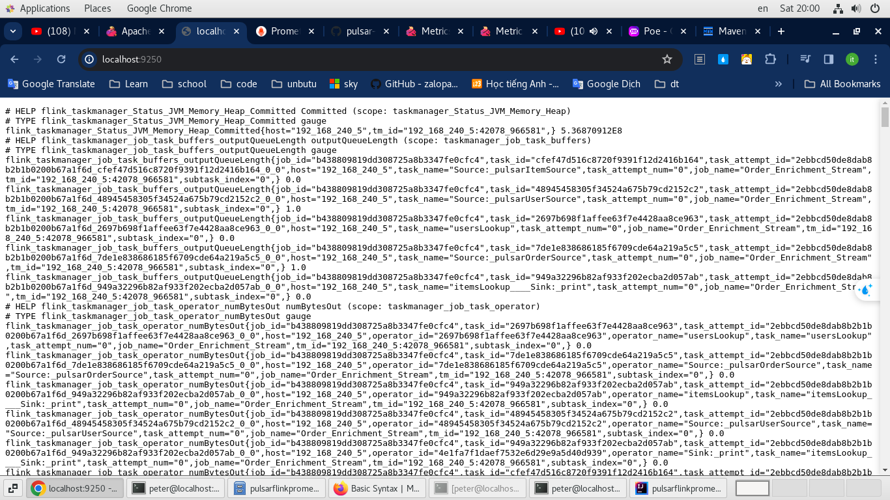
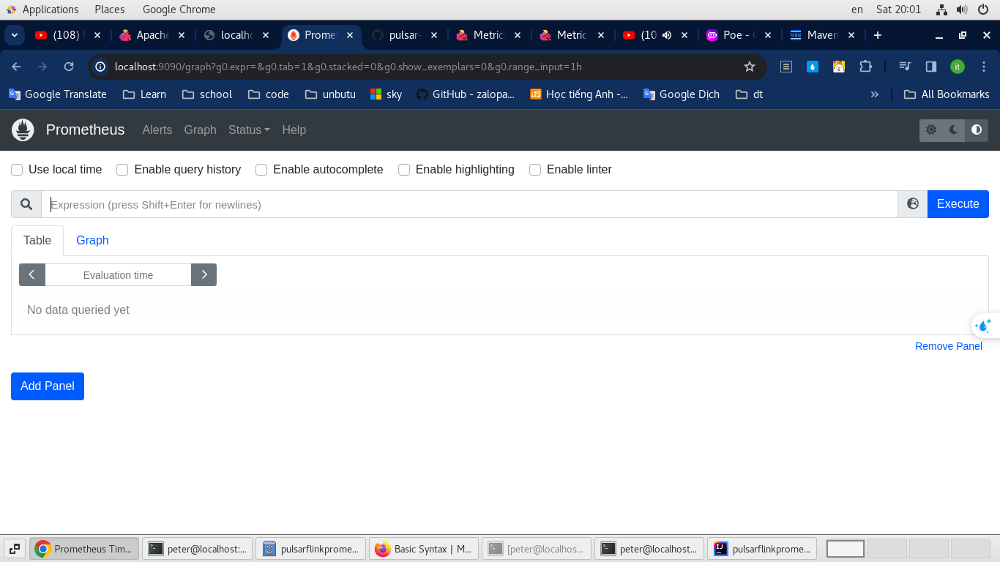
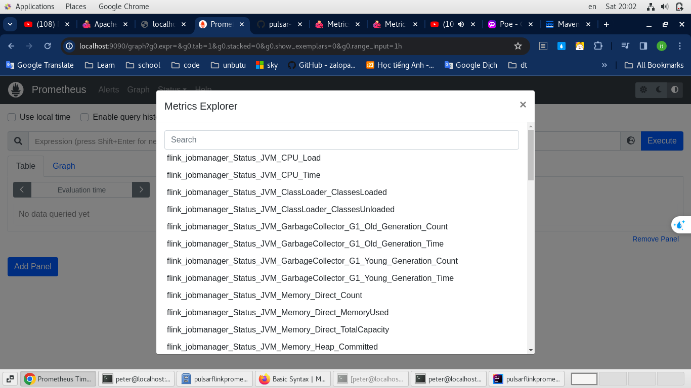
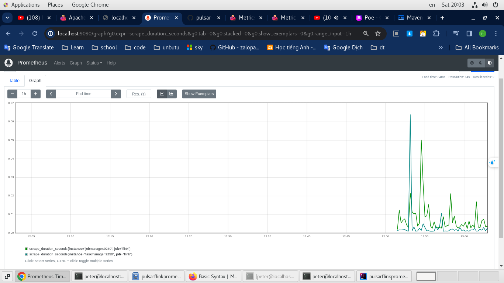

## Cd current folder

## Run mvn clean install 

## Run docker compose up -d

## run file: setup.sh

## run file deploy.sh

## Done

## run producer to testing: OrdersDataSource.class

### Apache flink dashboard: 
http://localhost:8081/
### Apache flink: 2 endpoint : job vs task
http://localhost:9249/  
http://localhost:9250/
### prometheus dashboard:
http://localhost:9090/

*** 

Image reference

